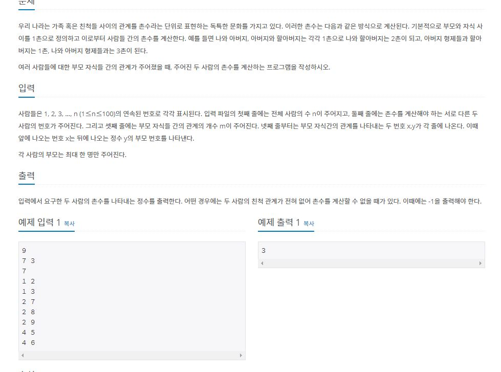
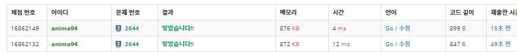

# study_Go
- for study go language  
- go lang 심화튜토리얼 :http://golang.site/
- golang tutorial study link : https://go-tour-kr.appspot.com/
- 내가 go언어 공부하는 사이트: https://thebook.io/006806/ 

### go언어 Project
-------------------------------
[은행계좌만들기](./BankProject_Go)

[URLCHECKER](./URLchecker_Go)

[전북대학교BOJ크롤러](./BOJ_CRAWLER_GO)

--------------------------

### my golang version

## go언어를 실행 할때는 터미널에서 go run 파일명.go
---------------------------------------
# ↓  STUDY_NOTE  ↓
### 왜 go언어를 해야하는가 ? 
- https://blog.jse.li/posts/torrent/
- https://blog.youngbin.xyz/2019-09-09-migrating-skhus-backend-from-nodejs-to-golang/
- https://github.com/golang/go/wiki/LearnServerProgramming
- https://www.buzzvil.com/ko/2018/02/12/tech-blog-go-%EC%84%9C%EB%B2%84-%EA%B0%9C%EB%B0%9C%ED%95%98%EA%B8%B0/

## go언어의 간단한 실용예

- http://golang.site/go/article/111-%EA%B0%84%EB%8B%A8%ED%95%9C-%EC%9B%B9-%EC%84%9C%EB%B2%84-HTTP-%EC%84%9C%EB%B2%84 (서버)
- http://pyrasis.com/book/GoForTheReallyImpatient/Unit58   (서버)
- https://mingrammer.com/building-blockchain-in-go-part-1/ (golang으로 blockchain만들기)
- https://www.joinc.co.kr/w/man/12/Kafka/chatting (kafka-Go를이용한 채팅어플리케이션)
## golang for backend
- Golang의 독특한 특징 3가지 - A declared are not used, Multiple return values, Timeout (https://voidmainvoid.tistory.com/128)

### go언어로 백준알고리즘 문제풀기 [BOJGolang](./BOJ_Go)

- 문제:

## go언어로 bfs 문제를 푸는 예시 (직접작성)

<code>
    
    package main
        import (
	    "bufio"
	    "fmt"
	    "os"
        )

        var n, m, num1, num2, x, y int
        var bufin *bufio.Reader = bufio.NewReader(os.Stdin)
        var bufout *bufio.Writer = bufio.NewWriter(os.Stdout)
        var grid [101][101]int
        var visited [101]bool
        var count [101]int

        func bfs(start int) {
            queue := make([]int, 0)
            queue = append(queue, start)

            for len(queue) > 0 {
                cur := queue[0]
                queue = queue[1:]
            for i := 1; i <= n; i++ {
                if grid[cur][i] == 1 && visited[i] == false {
                    visited[i] = true
                    count[i] = count[cur] + 1
                    queue = append(queue, i)
                    }
                }   
            }
        }
        func main() {
            defer bufout.Flush()
            fmt.Fscan(bufin, &n)
            fmt.Fscan(bufin, &num1, &num2)
            fmt.Fscan(bufin, &m)
            var a1, a2 int
            for i := 1; i <= m; i++ {
            fmt.Fscan(bufin, &a1, &a2)
            grid[a1][a2] = 1
            grid[a2][a1] = 1
        }
            bfs(num1)
            if count[num2] != 0 {
                fmt.Fprintln(bufout, count[num2])
            } else {
                fmt.Fprintln(bufout, "-1")
            }
        }

</code>

- 위의 코드와 같이 bufio reader writer를통해 시간을 엄청나게 단축시킬수있음 단순 fmt.Print,fmt.Scanf를 써서 문제를 풀었을시 12ms. bufio를 사용하여 reader를통해 받는 fmt.fScanf를사용시 4ms.  go 언어로 알고리즘 로직이 맞지만 시간초과가날시에 이를통해 해결한 사례가 많음. 

- for문은 그때그때 따라서 ~ 

<code>
	
	for _, number := range numbrs{ }
	
	for i:=0; i<len(numbers); i++ { }
	
</code>	

- go언어에도 pointer가있다 

<code>

        ///pointercase #1 

        func main(){
            a:=2
            b:=&a
            fmt.Println(*b)
        }

        ////// output:2 

        ///pointercase #2

        func main(){
            a:=2 
            b:= &a
            *b=20 
            fmt.Println(a)
       }
       //////output : 20 

</code>

## map에대해 알아보기 

<code>

        func main(){
            nico:=map[string]string{"name":"nico", "age":"12"}
            fmt.Println(nico)

            //output: map[age:12 name:nico]
        }

</code>

<code>

        
    func main() {

	nico := map[string]string{"name": "nico", "age": "12"}
	//fmt.Println(nico)
	for _, value := range nico {
		fmt.Println(value)
	}
	/* output:
	nico
	       12
	*/
    }

</code>

## struct sample

<code>

    type person struct {
	name string
	age  int
	food []string
    }

    func main() {
	food := []string{"kimchi", "ramen"}
	nico := person{name: "nico", age: 25, food: food}
	fmt.Println(nico.name)
    }

</code>

## at the sametime sample
<code>

        package main
        import (
	        "fmt"
	        "time"
        )

        func main() {
	    go sexycount("nico")
	    sexycount("junseong")

        }
        func sexycount(person string) {
	    for i := 0; i < 3; i++ {
		fmt.Println(person, "is sexy", i)
		time.Sleep(time.Second)
	     }
        }
        /* output:
            junseong is sexy 0
            nico is sexy 0 
             junseong is sexy 1
            nico is sexy 1
             junseong is sexy 2
            nico is sexy 2 
            

        */

</code>

### string to Int 

<code>

        package main
        import (
	    "fmt"
	    "os"
	    "strconv"
        )
        var s string
       
        func main() {
	    fmt.Scan(&s)
         test := 123
	    // string to int
	    i, err := strconv.Atoi(s)
	    if err != nil {
		fmt.Println(err)
		os.Exit(2)
	    }
	    fmt.Println(s, i+test)
        }
            /*  input : 123 
                output: 123 246   */
    

</code>
